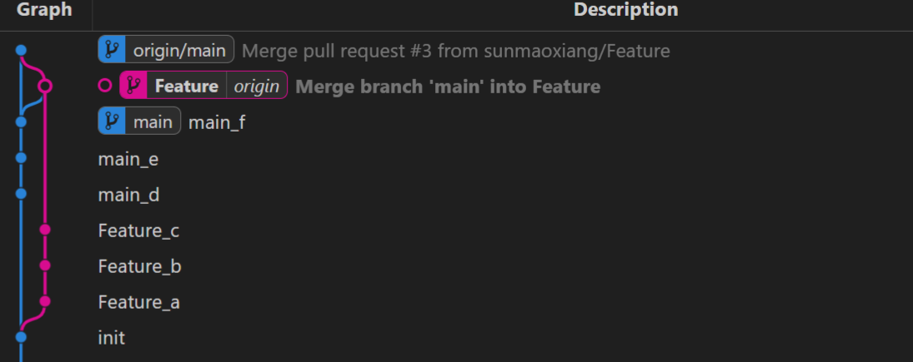
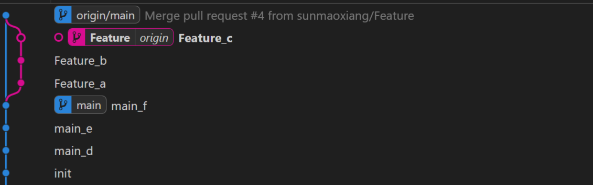

# what

在 Git 中整合来自不同分支的修改主要有两种方法：`merge` 以及 `rebase`。

merge：将指定分支合并到当前分支。

rebase：将当前分支rebase到指定分支。理解base是什么是关键，base可以看成基于xxx的变化，xxx就是基。


**不理解上面没关系，看看下面的how中的图就理解大概了**


分支是什么：使用分支意味着你可以把你的工作从开发主线上分离开来，以免影响开发主线。

# how

接下来的操作我主要是为了达成图示的形状，真正做到为了做什么而去实践，摸着石头过河！
## merge例子


接下来用实际命令做上面操作，这里使用vscode中的git graph做可视化。

```shell
git checkout -b Feature # 新建一个新的分支

# Create files
touch a b c

# Loop through files and commit them separately
for file in a b c; do
  # Add file to staging area
  git add $file

  # Commit changes with message "Feature_<filename>"
  git commit -m "Feature_$file"
done
```

现在git状态：

同理，为main分支做同样的操作

```shell
git checkout main # 切换到main

# Create files
touch d e f

# Loop through files and commit them separately
for file in d e f; do
  # Add file to staging area
  git add $file

  # Commit changes with message "Feature_<filename>"
  git commit -m "main_$file"
done
```

现在git状态：

之后执行命令：

```shell
git checkout Feature
git merge main
或者
git merge Feature main
```


注意：上面的操作都是将Feature合并到main中，而现实中不应该这么合并，而是应该将本地main与远端main保持一致，并将main合并到Feature中，并将Feature推到远端，这时候在页面是做pull request请求。例如下面的操作。


```shell
# 撤回上述操作
git checkout Feature
git reset --hard 23c34ce971d63226888a1149e2a1d19f4180667c // 退回Feature
git checkout main
git reset --hard 1e82baa474c32c7708e03253cec14ee10836ec4e
```


接下来将main push到远端，然后将main合并到Feature，最后在网页上进行pull request操作，即请求合并到main分支操作。

```shell
git push origin main
```


```shell
git checkout Feature 
git merge main # 这样更好理解，还是别用git check Feature main了，不知道谁合并谁 
```


```shell
git push origin Feature # 将Feature传到远端后即可使用pull Request了
```


此时，看一下最后的git状态，有些混乱哈哈哈哈！



## rebase例子

接下来给出 rebase例子，不过我们先要还原！

```shell
# 撤回上述操作
git checkout Feature
git reset --hard 23c34ce971d63226888a1149e2a1d19f4180667c // 退回Feature
git checkout main
git reset --hard 1e82baa474c32c7708e03253cec14ee10836ec4e

git push -f origin main
git push -f origin Feature  // 这里为啥要-f因为base改变了，可能是rebase也可能reset，都会导致base改变
```


接下来需要将Feature的基变为main的，并在此基础上做更新

```shell
(base) root@smx:/mnt/d/workspace/git-demo# git checkout Feature 
Already on 'Feature'
(base) root@smx:/mnt/d/workspace/git-demo# git rebase main
Successfully rebased and updated refs/heads/Feature.
```


**经过pull request后发现非常清晰！！！！**




# Why

什么时候用rebase，什么时候用merge还需要实践慢慢给出原由，现在以我的认知是rebase确实通过图示更清晰一些，而且rebase操作还可以做多个commit的合并，利用git rebase -i。